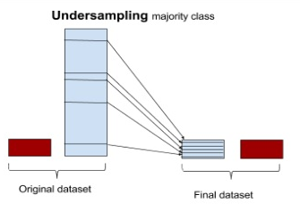

## Credit Card Fraud Detection
Imbalance dataset or Rare Event - Supervised Classification Problem

### Goal 
* Identifying the Fradulent Transactions

### Overview of the Dataset
The datasets contains transactions made by credit cards in September 2013 by european cardholders. This dataset presents transactions that occurred in two days, where we have **492 frauds out of 284,807 transactions**. The dataset is highly unbalanced, the positive class **(frauds) account for 0.172% of all transactions**.
It contains only numerical input variables which are the result of a PCA transformation. Unfortunately, due to confidentiality issues, we cannot provide the original features and more background information about the data. **Features V1, V2, ... V28 are the principal components obtained with PCA**, the only features which have not been transformed with PCA are 'Time' and 'Amount'. Feature 'Time' contains the seconds elapsed between each transaction and the first transaction in the dataset. The feature 'Amount' is the transaction Amount, this feature can be used for example-dependant cost-senstive learning. Feature 'Class' is the response variable and it takes value 1 in case of fraud and 0 otherwise.

## How did I solve this??
As we know from the dataset overview this dataset is highly imbalance
* **Resample** the data to balance it
* used **SMOTE (Synthetic Minority Oversampling TEchnique)** to sample the data
* Finding the Highly Positive/Negatively **correlated variables** using **correlation matrix**
* **Outlier Detection and Removal** of highly correlated variables using **Boxplots** and **Inter Quartile Range Method**
* **Model Selection**
* used **K-Fold Cross Validation** to avoid **overfitting or underfitting**
* Developed **Random Forest Classifier**
* **Tuned parameters** using **GridSearchCV** for better results
* **Metric** used are **Confusion_Matrix , Classification_Report & AUROC**

#### Resampling Techniques:
Resampling is a common practice to address the imbalanced dataset issue. Although there are many techniques within resampling,there are three most popular techniques 
* **Random Under Sampling:** Randomly Eliminates Majority Class instances until it balances with the Minority Class **disadvantage** is there is a possibility of eliminination of useful data,making the algorithm predict inaccurately

* **Random Over Sampling:** Randomly replicates the Minority class to increase in its frequency/count to match Majority Class.In this technique there is no loss of information but possibility of **overfitting** the model since it replicates data

* **SMOTE (Synthetic Minority Oversampling TEchnique):** Increase Minority class by Introducing synthetic examples through connecting all k(default = 5 ) minority class nearest neighbors using feature space similarity (Eculidean Distance)
*Reference:* [SMOTE-Synthetic Minority Oversampling TEchniques (youtube)](https://www.youtube.com/watch?v=FheTDyCwRdE)

#### Right Way of Resampling:
* **Split** the **original Train data** into train & test
* sample the splitted train data
* **Train** the model on sampled train data
* perform **Prediction** on **original Test data**

#### Outlier Detection

* **Boxplots:** Besides easily seeing the 25th and 75th percentiles (both end of the squares) it is also easy to see extreme outliers (points beyond the lower and higher extreme)

#### Interquartile Range Method:
* **Interquartile Range (IQR):** We calculate this by the difference between the 75th percentile and 25th percentile. Our aim is to create a threshold beyond the 75th and 25th percentile that in case some instance pass this threshold the instance will be deleted.

#### K-Fold Cross Validation
* K-folds cross-validation **splits the training dataset** into **k-folds without replacement**,i.e., any given data point will only be part of   one of the subset, where k-1 folds are used for the model training and one fold is used for testing. The procedure is repeated k times   so that we obtain k models and performance estimates.
* We then **calculate the average performance** of the models based on the individual folds

#### Confusion Matrix
* A confusion matrix is a table that is often used to **describe the performance of a classification model (or "classifier")** on a set   of test data for which the true values are known

* **True Positive:**  correctly classified Fraud Transactions
* **True Negative:**  correctly classified Non-Fraud Transactions
* **False Positive:** Incorrectly classified Fraud Transactions
* **False Negative:** Incorrectly classified Non-Fraud Transactions

#### Classification-Report
* The classification report  **displays the precision, recall, F1 and support scores** for the model
* **Precision:** True Positives/(True Positives + False Positives)
  Precision is the ability of a classiifer not to label an instance positive that is actually negative. 
* **Recall:** True Positives/(True Positives + False Negatives)
  Recall is the ability of a classifier to find all positive instances
* **f1 score:** The F1 score is a **weighted harmonic mean** of precision and recall such that the **best score is 1.0 and the worst is   0.0
* **support:** Support is the number of actual occurrences of the class in the specified dataset

#### Parameter Tuning
* **GridSearchCV**
* **RandomizedSearchCV**
